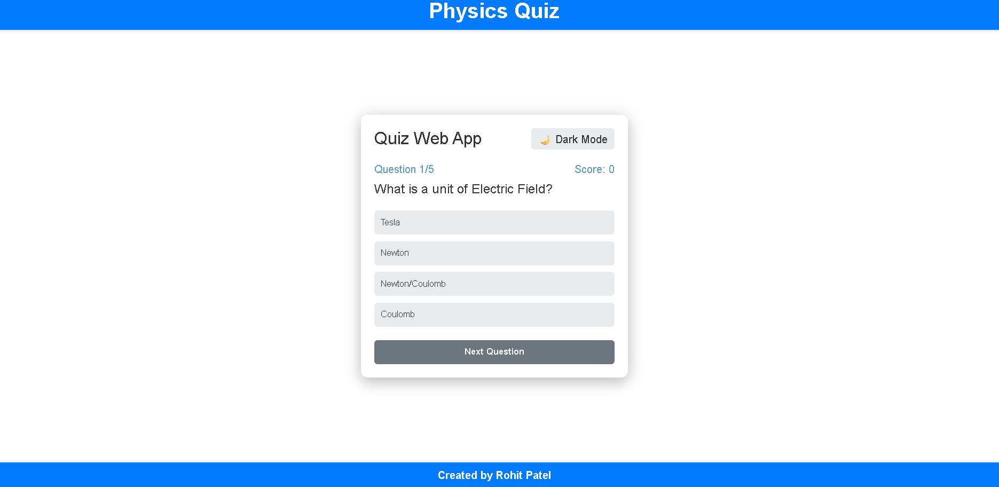
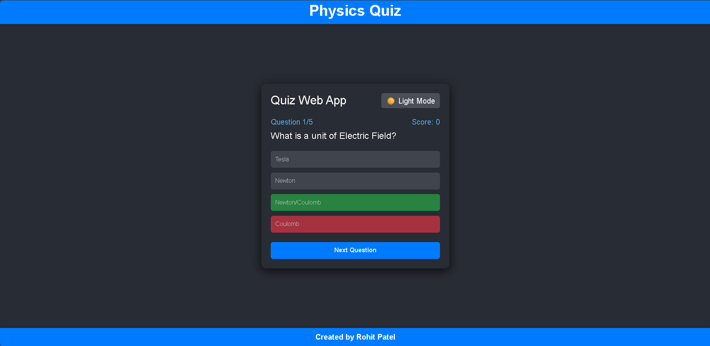
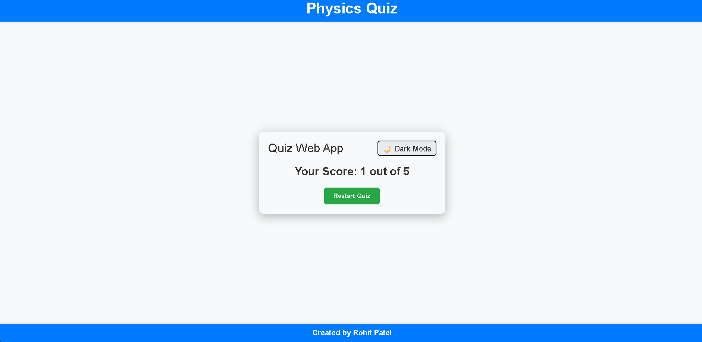

# Physics Quiz Web App





An interactive physics quiz application built with React.js that works on mobile, tablet, and desktop devices. Features dark/light mode toggle, instant answer feedback, and responsive design.

## Features

✅ **Multi-device Support** - Fully responsive for mobile, tablet and desktop  
✅ **Dark/Light Mode** - Toggle between color themes  
✅ **Instant Feedback** - See correct/incorrect answers immediately  
✅ **Score Tracking** - Tracks your progress through the quiz  
✅ **Restart Option** - Take the quiz multiple times  

## Technologies Used

- React.js
- CSS3 (Flexbox/Grid)
- HTML5
    - Responsive Design (Mobile First)
- Git/GitHub

## Getting Started

### Prerequisites

1. HTML5
2. CSS3
3. Javascript
4. React js

2. Install dependencies:
```bash
npm install
Before you begin, ensure you have these installed:

- Node.js (v14 or later)
- npm (comes with Node.js) or yarn
- Git (for version control)

### Installation

1. **Clone the repository**:

```bash
git clone (https://github.com/Rohit-Patel-Techie/quiz-web-app.git)
